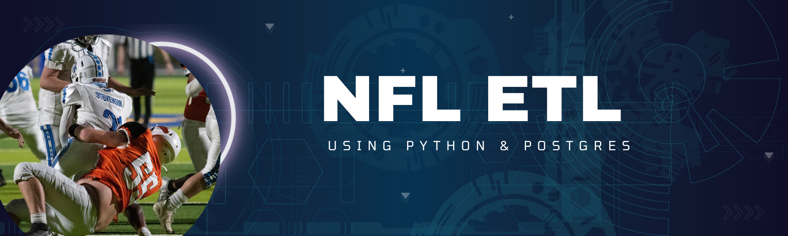

# proj-nfl-etl

Author:  Erin James Wills, ejw.data@gmail.com

<cite>Photo by <a href="https://unsplash.com/@shootwithlou?utm_source=unsplash&utm_medium=referral&utm_content=creditCopyText">Luis Santoyo</a> on <a href="https://unsplash.com/photos/lI0JXf4MRDM?utm_source=unsplash&utm_medium=referral&utm_content=creditCopyText">Unsplash</a></cite>

 

## Overview  

The purpose of this project is to build a more comprehensive collection of NFL player data.  The inspiration for this project came from past difficulties trying to obtain a high quality dataset.   Each resource that had been previouly reviewed has signficiant limits – limited free datasets, limited time frame, and missing data.  The goal of this dataset is to provide a starting point for future projects.  
